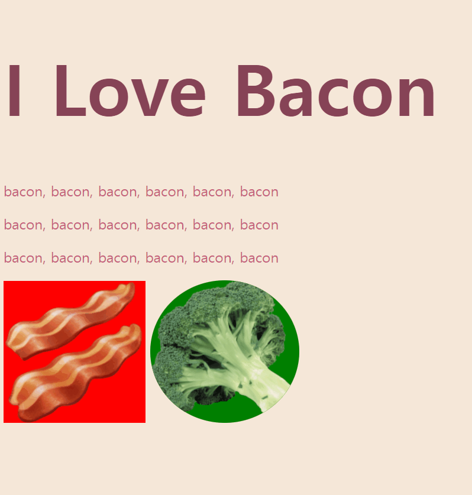

# Day43 - Web Foundation - Introduction to CSS
## Day42 Project : [CSS Practice](index.html)
 : Added tables and forms to my website   
 
## What I studied to build this website
  1. External CSS, Internal CSS, Inline CSS
  2. CSS Syntax 
     '''h2 {
          color: red;
          text-align: center;
        }'''
  3. .class Selector
    -selects elements with a specific class attribute
   '''
      .broccoli{
        background-color: green;
        }
      .circular{
        border-radius: 100%;
        }'''
  5. #id Selector
    -styles the element with the specified id
   '''<h1 id="heading">I Love Bacon</h1>
      #heading {
        color:#874356;
      }'''
  6. :hover Selector
    -used to select elements when you mouse over them
    '''img:hover{
          background-color: gold;
        }'''
  7. Properties
    : background-color, border-radius, color, font-size, border-style, border-top-style-border color, etc
